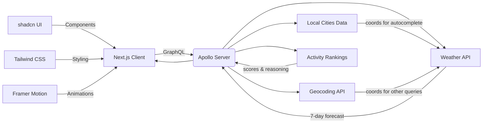

# 🌤️ Travel Activity Ranking Demo  
**A Next.js + React + Apollo GraphQL application that predicts how desirable a city will be for skiing, surfing, outdoor sightseeing, and indoor sightseeing over the next 7 days.**

---

## 1. Why This Exists
A client asked for a "walk-through-ready" proof-of-concept that emphasises clean architecture, long-term maintainability, and clear communication.  
Time-boxed to ± 3 hours, the goal was to show **how** we would build a production-grade system, not to ship every bell and whistle.


[Live Demo](https://activity-weather.vercel.app/)


---

## 2. Architectural Overview

| Layer            | Tech & Purpose | Key Files/Folders |
|------------------|----------------|-------------------|
| **UI**           | React 19 + Next.js 15.2 + TypeScript | `app/`, `components/` |
| **Design-System**| Storybook 9 with component stories | `components/*.stories.tsx` |
| **Component Library** | shadcn UI built on Radix UI primitives | `components/ui/` |
| **State Management** | React Hooks + Context | `hooks/` |
| **Animations** | Framer Motion | Various components |
| **API Gateway**  | Apollo Server  | `graphql/` |
| **Weather & Geo**| Open-Meteo REST APIs | `graphql/resolvers.ts` |
| **Activity Rankings** | Custom scoring algorithm | `utils/activity-rankings.ts` |
| **Styling**      | Tailwind CSS 3.4 with CSS variables | `app/globals.css`, `tailwind.config.ts` |
| **Theming** | Dark/Light mode with next-themes | `components/theme-provider.tsx` |
| **Static Assets**| `data/cities.ts` – World-cities list for instant autocomplete | `data/` |



### 2.1 GraphQL Schema Highlights
```graphql
type Query {
  forecast(
    latitude: Float!
    longitude: Float!
    daily: [DailyVariable!]
    current_weather: Boolean
    timezone: String
    past_days: PastDays
  ): Forecast
  
  geocode(
    name: String!
    count: Int
    language: String
    countryCode: String
  ): GeocodingResponse
}

type Forecast {
  latitude: Float
  longitude: Float
  daily: DailyResponse
  current_weather: CurrentWeather
  activityRankings: [ActivityRanking]  # nested resolver for activity rankings
}

type ActivityRanking {
  activity: String!
  averageScore: Float!
  dailyScores: [Float!]!
  reasoning: String!
}

type Location {
  name: String
  latitude: Float
  longitude: Float
  country: String
  forecast: Forecast  # stitched sub-resolver
}
```
*Example nested query with latitude and longitude root parameters; for use in auto-complete where geocoding lookup isn't needed:*
```graphql
query GetWeatherAndActivityData($latitude: Float!, $longitude: Float!) {
  forecast(latitude: $latitude, longitude: $longitude) {
    daily {
      time
      temperature_2m_max
      temperature_2m_min
      precipitation_sum
      wind_speed_10m_max
      weather_code
    }
    current_weather {
      temperature
      wind_speed
      wind_direction
      weather_code
    }
    activityRankings {
      activity
      averageScore
      dailyScores
      reasoning
    }
  }
}
```


```
*Example using geocode (city name search) resolver to get city data and nested forecast resolver:*
```graphql
{
  geocode(name: "Tokyo, Japan") {
    results {
      id
      name
      latitude
      longitude
      country
      admin1
      forecast {
        current_weather {
          temperature
          wind_speed
          wind_direction
          weather_code
        }
        activityRankings{
          activity
          averageScore
          reasoning
        }
      }
    }
  }
}
```

### 2.2 Scoring and Ranking Algorithm

The activity ranking system uses a points-based scoring algorithm (0-100 scale) to evaluate weather conditions for different activities. Located in `utils/activity-rankings.ts`, the algorithm works as follows:

#### Points-Based Scoring System

Each activity receives points across four weather factors:

| Activity | Weather Factors | Points Allocation |
|----------|----------------|-------------------|
| Skiing | Temperature, Snow, Wind, Sky clarity | Cold temps (up to 40pts), Snow presence (up to 30pts), Low wind (up to 20pts) |
| Surfing | Temperature, Precipitation, Wind, Sky clarity | Moderate temps (up to 30pts), Low precipitation (up to 25pts), Moderate wind (up to 25pts) |
| Outdoor Sightseeing | Temperature, Precipitation, Wind, Sky clarity | Pleasant temps (up to 30pts), No rain (up to 30pts), Light wind (up to 20pts) |
| Indoor Sightseeing | Precipitation, Temperature extremes, Wind, Poor weather | Points for bad outdoor conditions + 20pt base score |

#### Ranking Process

1. Daily scores are calculated for each activity across the 7-day forecast
2. Activities are ranked by their 7-day average score
3. Each receives a qualitative label: Excellent (≥80), Good (≥60), Fair (≥40), or Poor (<40)

The GraphQL API returns both numerical scores and human-readable reasoning for each activity.

### 2.3 Cities Data & Autocomplete Architecture

The city data for autocomplete search is intentionally kept separate from GraphQL resolvers and managed client-side for these reasons:

- **UI-Specific Feature**: Autocomplete is a UI interaction that benefits from immediate responses
- **Performance**: Instant, zero-latency autocomplete with no network requests
- **Offline Capability**: Search works without network connectivity
- **Reduced Server Load**: No additional requests for each keystroke
- **Implementation Simplicity**: Straightforward approach for a static dataset

This trade-off prioritizes UI responsiveness over architectural consistency, which is appropriate for this feature. If the city dataset were to grow significantly or become dynamic, moving to a GraphQL resolver approach would make more sense.

---

## 3. Developer Experience

| Task | Command | Live |
|------|----------|----------|
| Install | `npm install` | N/A |
| Development | `npm run dev` → http://localhost:3000 | https://activity-weather.vercel.app/ |
| Build | `npm run build` | N/A |
| Start | `npm run start` | N/A |
| GraphiQl | `http://localhost:3000/graphql-playground` | https://activity-weather.vercel.app/graphql-playground |
| Storybook | `npm run storybook` → http://localhost:6006 | In progress | 
| Build Storybook | `npm run build-storybook` | N/A |
| Lint | `npm run lint` | N/A |
| Unit Tests | `npm run test` (Jest testing of activity-rankings) | N/A |

### 3.1 GraphQL Playground/GraphiQL
1. Start the development server (`npm run dev` or `yarn dev`)
2. Access the GraphQL playground at /graphql-playground
   → Try the examples above

### 3.2 Storybook
Storybook documents the components (autocomplete-search, activity-card, activity-detail-panel, activity-rankings).  
Benefits: isolated visual tests, best practice enforcement of isolating display components with data layers. Encourages re-use and consistent design accross UIs 

### 3.3 Jest Unit tests
There are unit tests around the key business logic of the solution; the activity ranking and reasoning algorithm. Run via `npm run test`. Test driven development is best practice to ensure logic meets functional requirements and to protect agains unintended side effects in future development.

---

## 4. Key Technical Choices & Rationale (Client-Facing)

| Decision | Why It Benefits Your Organisation |
|----------|------------------------------------|
| **GraphQL with Apollo** | Hides third-party REST quirks, supports single-round-trip composite queries (⬆️ performance, ⬇️ coupling). Built with industry-standard Apollo Server. |
| **Next.js 15 App Router** | Server components, file-based routing, API routes, and improved performance with the latest Next.js features. |
| **React 19** | Access to latest React features and performance improvements. |
| **Static `cities.ts`** | City lists change rarely → 0 latency search, no runtime quota costs. |
| **Tailwind CSS 3.4** | Utility-first CSS framework providing consistent styling, faster development, and smaller bundle sizes with easy theming via CSS variables. |
| **shadcn UI** | Accessible, customizable component library built on Radix UI primitives for high-quality, consistent UI with full control. Allows adaptation to your design system. |
| **Framer Motion** | Polished animations and transitions that improve user experience and perceived performance. |
| **Storybook 9** | Latest version with improved performance, component documentation, and testing capabilities. Enforces design-system discipline and accelerates cross-team collaboration. |
| **TypeScript** | Type safety throughout the application, improving maintainability and reducing runtime errors. |
| **Dark/Light Mode** | Built-in theme support with system preference detection for improved user experience. |

---

## 5. AI Assistance

AI strategy was to use Claude 3.7 in areas of isolated scope; such as the initial generation of graphql schema from the open-meteo [openapi.yaml](https://github.com/open-meteo/open-meteo/raw/refs/heads/main/openapi.yml) and initial resolvers. These were then analysed and customised. This is to reduce human error in manually translating formats

AI was also used to generate content such as "Alternative Destinations" for presentation purposes. This would be generated dynamically or via real curated content in the final production app.

---

## 6. Omissions & Trade-Offs

| Skipped / Simplified | Rationale | Future Upgrade Path |
|----------------------|-----------|---------------------|
| **No DB / Caching** | 3-hour scope; Open-Meteo is free & fast. | Add Redis edge cache; cron job pre-fetch daily forecasts. |
| **Styling Customization** | Using Tailwind and shadcn defaults with minimal customization. | Extend Tailwind configuration with your custom design-system tokens and further customize shadcn components. |
| **Limited Unit Test Coverage** | Time constraint. | Unit tests were added for the key ranking algorithm but should be expanded to cover more of the application. |
| **Full E2E Tests** | Time constraint. | Cypress E2E testing suite integration |
| **Error i18n** | English-only for brevity. | Implement next-intl or next-i18next. |
| **Accessibility Audit** | Manual light pass only. | Integrate the existing Storybook a11y addon and implement ARIA improvements. |
| **CI/CD** | Not needed for demo. | Add GitHub Actions with Jest unit tests, Cypress tests, and automatic preview deployments. |
| **Auth / Rate Limiting** | Not needed for demo. | Add NextAuth.js and API route middleware for authentication and rate limiting. |
| **More factors needed to provide real-life usable rankings** | Instruction to use Open-Meteo as only data source | Geographic, real-human experience information needed. Perhaps use of AI to reason over weather, real life conditions, and other factors to provide more accurate rankings.  |

---

## 7. Running This in Production

1. **Edge Cache** – store 7-day forecasts keyed by lat/lon, TTL = 3 h using Vercel Edge Cache or similar.  
2. **Auto-Scaling** – Next.js API routes are serverless and stateless → easy deployment to Vercel or similar platforms.  
3. **Monitoring** – integrate observability tools like Vercel Analytics or OpenTelemetry for Next.js.  
4. **Performance Optimization** – leverage Next.js built-in image optimization, code splitting, and server components.  
5. **CI/CD** – Test coverage, test-success, build-success and so-on should be integrated into the CI/CD pipeline. Pre-conditions should be met before human pull-request reviews are considered; and a requrement for merges of feature branches.

---

## 8. Contributing

1. `npm install`  
2. Create feature branch.  
3. Run `npm run dev` for development and `npm run storybook` to test component changes.  
4. Run `npm run lint` before PR to ensure code quality.  
5. Add appropriate stories for new components.  
6. PR template prompts for architecture decision record (ADR).

---

## 9. Contact

*Prepared by Timothy Broome © 2025*  
For questions, open an issue or reach me at **tim@broome.me**.

---
